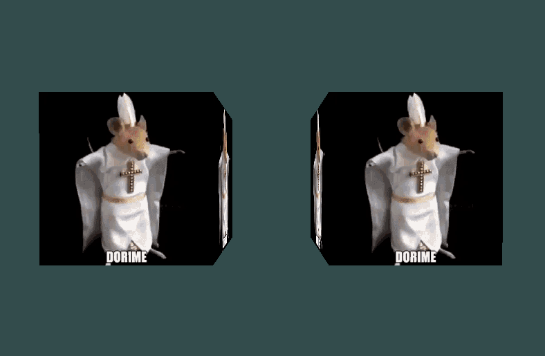

# Java OpenGL

Creating 3D graphics using the LWJGL library and Java

Project contains basic window, basic keyboard and mouse Inputs, extremely simple 1st person camera (However camera won't move in the direction when looking UP or Down)

No future plans for updating this repo

## Learning sources
1. http://www.opengl-tutorial.org/beginners-tutorials/tutorial-4-a-colored-cube/
2. https://lwjglgamedev.gitbooks.io/3d-game-development-with-lwjgl/content/
3. https://learnopengl.com/Introduction
4. https://javadoc.lwjgl.org/overview-summary.html
5. https://www.glfw.org/docs/latest/input_guide.html

